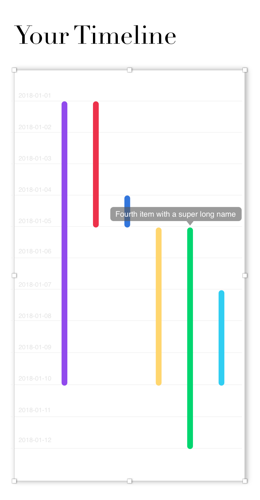

# React Timeline Component

This is a React component for visualizing events on a timeline. 

## Installation
Run `npm install`, and then `npm start` to view in browser. 

## Usage

### Required Props

* data: ```json``` in the shape:

```
[
	{
		id: "number",
		start: "YYYY-MM-DD",
		end: "YYYY-MM-DD",
		name: "string"
	},
	...
]
```
### Optional Props

* width: ```number```. Default value is `300`
* height: ```number```. Default value is `600`

## Design Decisions

Browsing 'timelines' for inspiration on Dribbble, I realized that none of them quite fit my requirements, and thus I was able to hone in on the crucial requirements of the timeline component. 

Most timelines display only isolated events on the continuum, whereas I needed to show many events with their durations, potentially overlappin. The closest logic fit was a [package tracking timeline](https://cdn.dribbble.com/users/187214/screenshots/5288770/myh-messages_4x.png). What I like about this timeline design is the easy-to-follow representation of elapsed time. For instance, the package left on Oct 4, arrived at a shipping hub on Oct 8, where it stayed until Oct 10. 



None of the event items have apparent relation, so I decided to put them in separate "lanes", order them by start date, and use a diverse swatch to visual distinguish them. At the cost of compactness, this arrangment helps me handle long event names, and creates a logical hierarchy of events.


### Defined Requirements

* Visually compact
* Display event title
* Clearly show duration of event
* Zoom in/out functionality (d3.js)
* Inline editable titles (React)
* Dragging events to edit (d3.js)

### Additional requirements I set for myself

* Easily reusable by other developers
* Responsive, should look good as a main body widget, or as sidebar widget

## What I Like

* [Ducks](https://github.com/erikras/ducks-modular-redux) (Redux reducer bundles) for Redux code. Much better than traversing three or more different files for one action!
* Separation of functionality: D3 for calculation ONLY, React for DOM manipulation. 
* SCSS for svg styling, styled-components for other styling.
* D3 will allow for easily adding features later, such as zoom, drag & drop, etc.

## Looking Forward

* Readability is not optimal, overall scale is too small.
* Bars are slightly cut-off at bottom.
* Bars should be darkening on hover.
* Left padding should push bars off of date labels.
* Component overflow should be X and Y scrollable.
* Tooltip should close on mouseoff with a 2 sec timeout.
* BUG: if name is empty, tooltip is impossible to edit.
* Hover on a day highlights row, and intersecting events.
* Overall design may not be optimal. User could want to see the titles by default.
* D3 is a library with a steep learning curve! I will have to keep practicing.

## Testing

* Drawing on this [article](https://blog.kentcdodds.com/write-tests-not-too-many-mostly-integration-5e8c7fff591c) by Kent Dodds, integration testing is the most "bang for your buck" (effort vs. certainty gained). 
* Test Timeline component's contract: displays 1 bar for each event item from props, shows tooltip on hover with the matching event item name.
* Test InlineEdit component's contract: should be hidden when value is empty, should render an input onClick, render div onBlur or "enter" key press, should display user's changes.

## Links

* [Trello](https://trello.com/b/Lmpu9AS6/react-timeline)